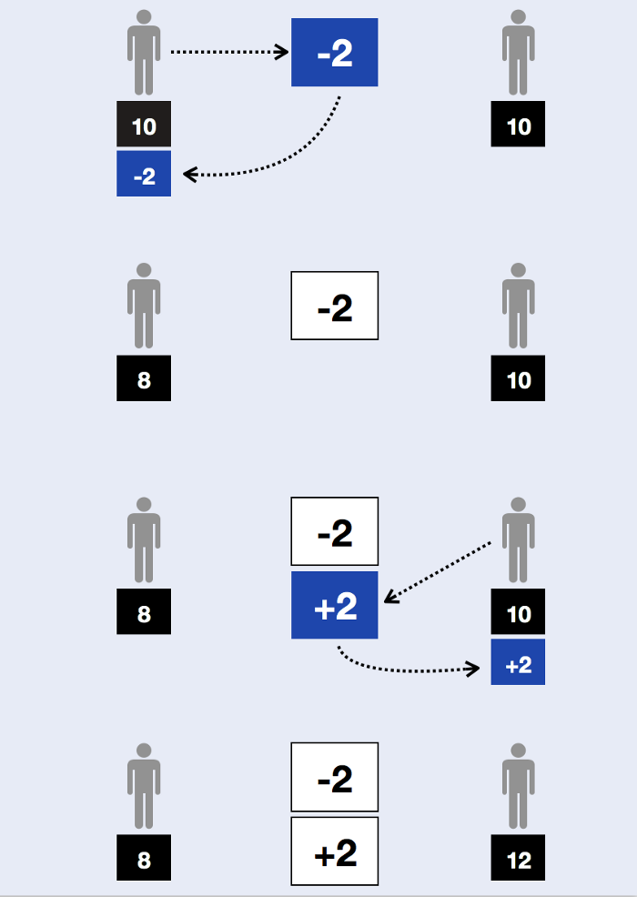
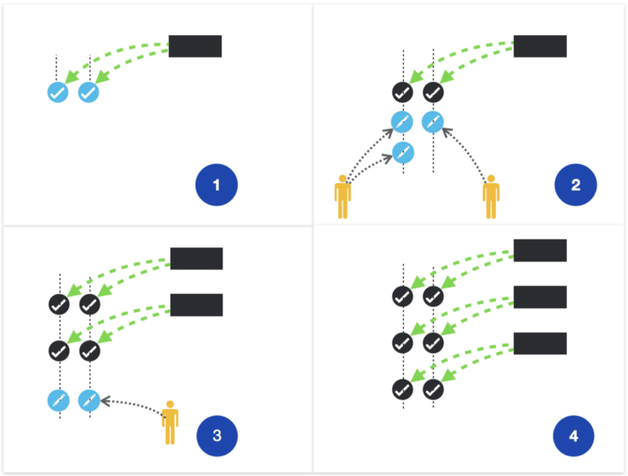

# An Introduction to Vite Asynchronous Architecture

Vite is a new generation of reactive blockchain, which adopts a message-drive asynchronous architecture. In Vite ecosystem, asynchronous is not only an important concept, but also a very critical innovation.

## The Model of Asynchronous Requests

Transactions in Vite can be categorized as request transactions and response transactions. Regardless of whether an event is a transfer or the call of a contract, two successive transactions get generated on the ledger.

A transfer can be split into a receive transaction and a send transaction; a transaction to invoke a contract can be split into a contract request transaction and a contract response transaction; the message call within each contract can be split into a request transaction and a response transaction.

After the split, each transaction only affects the state of a single account, and transactions do not interfere with one another, which improves throughput. In addition, transactions by different accounts are also allocated to different nodes in the network, thereby increasing scalability.

## The Model of Asynchronous Confirmation

In the Vite framework, writing transactions into a ledger and receiving confirmations by the system are also asynchronous. Different users may write transactions into the ledger in parallel., and the snapshot chain will take snapshots of the ledger at a constant rate. A confirmation happens once a snapshot of a transaction is taken. As the snapshot chain grows, the number of confirmations will also increase.

## The Model of Asynchronous Communication

Vite’s inter-contract communications incorporate a message-driven architecture, where the contracts do not share states but only communicate by sending messages to each other.

If a contract calls another contract, the former needs to send a request transaction first. This is logically similar to producing a message in MQ. After the node running the target contract observes the request transaction, the node writes a corresponding response transaction in the ledger, and updates the state of the contract. This process is equivalent to consuming a message from MQ.if a return value is needed, the target contract will send another message to the source contract in the same way.

In this model, Vite’s ledger serves the role of the message middleware, and can guarantee the exactly-once semantics of messages.

The message-based architecture features high throughput and scalability. But on the flip side, the programming models become more complex. Not only is strong consistency not guaranteed, but latencies may become longer.

To address the above issues and reduce the cost of asynchronous programming, Vite will provide a contract language called Solidity++ and a full SDK associated with it. After rigorous research, we found that in actual scenarios, BASE semantics can replace ACID semantics. The increase in delay is still under control since the HDPoS consensus algorithm guarantees completion of the transaction confirmation within 1 second.
