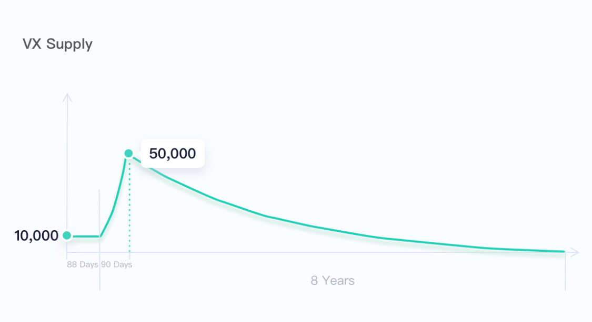

# Introduction

:::tip Concepts

**ViteX**, developed by Vite Labs, is the world's first decentralized exchange built on DAG technology.  

**ViteX Coin, VX**, is the coin native to the ViteX platform. It is mined exclusively by the ViteX community and is used to allocate rewards back to the community.

VX holders can receive daily **ViteX Rewards** from a shared reward pool which aggregates all trading fees accumulated by ViteX and redistributes back to VX holders.

See: [VX One Pager](./one-page.html)
:::

## Highlights

* **Features**
  - On-chain order matching
  - Smart contract enabled trading fee collection and reward distribution 
  - Listing a new trading pair only requires 10,000 VITE
* **Truly Decentralized**
  - Anyone can become a ***ViteX Operator***
  - ViteX Operators have the privilege to set trading fees, suspend trading and list new trading pairs
  - All features for Operators are implemented in the smart contract
* **Five Ways to Mine VX**

## ViteX Coin（VX）

### VX Basics

* **Total Supply**: **29,328,807.8**
* **Smallest Denomination**: $10^{-18}$
* **Features**: VX holders receive daily rewards from a shared reward pool which aggregates the trading fees accumulated by ViteX and redistributes back to VX holders.
* **Distribution**: No pre-sale. The following mining methods are the only way to obtain VX:
  - Trading as Mining: Trade in designated BTC, ETH, VITE and USDT markets and receive VX rewards.
  - Staking as Mining: Stake VITE to help ViteX obtain higher level operational Quota and receive VX rewards.
  - Referring as Mining: Generate a referral code to invite friends to join ViteX and receive VX rewards. 
    * Inviters will be rewarded with 5% of all invitees’ trading as mining proceeds and 2.5% of their market making as mining proceeds.
    * Invitees will enjoy 10% off platform trading fees, and receive an extra 2.5% of trading rewards and extra 1.25% of market-making rewards.
  - Market-Making as Mining: Help improve order book depth by placing buy and sell orders and receive VX rewards.
  - Listing as Mining: Become a ViteX operator and list trading pairs to collect user transactions fees and receive VX rewards.
* **Release Schedule**: All VX will be released over the course of 8 years and 3 months. 
  
### VX Distribution Schedule

The total supply of VX is ***29,328,807.8*** with no inflation, which will be fully distributed in two phases.

* **Phase 1**: Buffer phase that has ended on December 6, 2019. A fixed amount of 10,000 VX was released daily.

* **Phase 2**: Standard Phase. In this phase, VX will be released according to below schedule:

  * Sub-phase 1: Starting at 10,000 from December 7, 2019, daily release will increase for 90 days at a fixed rate of **1.80435%**, until reaching **50,000** on March 6, 2020
  * Sub-phase 2: Starting from March 7, 2020, at a daily decrease rate of **0.189724%**, annual release will decrease by half each year until fully distributed after 8 years.

### Mining Allocation

The release of VX will be allocated daily as the breakdown below:

* Trading, referring and listing: ***55%***
  - BTC market: ***13.75%***
  - ETH market: ***13.75%***
  - VITE market: ***13.75%***
  - USDT market: ***13.75%***
* Staking: ***20%***
* Market-making: ***15%***
* Team: ***10%***

### VX Holder Rewards

All trading fees charged by ViteX will be put into a shared reward pool and distributed at a daily rate of **1%**. For any given day, the fees collected of the day will be distributed completely in the next 100 days.

To receive your rewards:
* A minimum of **10 VX** must be staked in the exchange account. Please note that VX held in a wallet or exchange account will not make you eligible for rewards;
* Participant is entitled to receive rewards starting with the next distribution immediately after submission of staking request;
* Staked VX will be released after the 7-day (7 complete cycles) waiting period once retrieved. No reward will be received during this waiting period.
Users can enable automatic staking. Mined VX will be automatically staked once enabled, purchased VX is not subject to this function.

:::tip Attention
Trading fees charged by Operator (Operator Fee) are excluded from rewards. 

Starting from December 8, 2019, base fees collected in **VITE** are not sent to the reward pool but will be destroyed. The cumulative VITE in the reward pool were destroyed as well. 
:::

## Mining Details

### Trading as Mining

Mines approximately 55% of daily released VX. Currently, users are able to trade in four markets to receive VX rewards accordingly: BTC, ETH, VITE and USDT.

* **Allocation**: Each market receives 13.75% of daily distributed VX. 
* **How to participate**: Fulfill orders on **eligible trading pairs**.
* **Mining calculation**: The calculation is based on the proportion of your cumulative trading fees to the total trading fees collected in the associated market. For example, if a trader contributed 5% of the total trading fee of BTC market on the day, the trader will receive 5% of the 15% of VX applied to the market. 
    
### Staking as Mining

By staking VITE to help ViteX obtain operational Quota and receive VX rewards.

* **Allocation**: 20% of daily released VX
* **How to participate**: Stake VITE on ViteX.
  - **Staking amount**: The minimum amount is 134 VITE. No maximum cap.
  - **Staking duration**: Staked VITE can be retrieved after 3 days. There is no maximum number of days for staking VITE but a retrieving period of 7 days, and the staked VITE will not be counted towards staking as mining rewards during this period.
* **Mining calculation** : The calculation is based on the proportion of your staked VITE to the total staking amount on ViteX. 
  
### Market-Making as Mining

Mines 15% of daily released VX; BTC market at 7.5%, ETH and VITE market equally at 2.25%, USDT market at 3%.

Placing orders on ViteX can help you earn VX. The amount of VX earned depends on three factors: 1) the amount of order, 2) the amount of time your order remains on the order book, and 3) the amount of deviation from the best bid and best offer in the order book spread.

* **Allocation**: 15% of daily released VX
  - BTC market **7.5%**
  - ETH market **2.25%**
  - VITE market **2.25%**
  - USDT market **3%**
* **How to participate**: Place orders on ViteX order book.
  - Only eligible trading pairs will be considered;
  - Both buy and sell orders are considered;
  - Orders must not deviate from the designated mining range in the order book.

> The VX mining reward for market-making has a linear relationship with the **order amount** and **order duration** (i.e. amount of time the pending order stays on the order book). 
However, the mining reward has an exponential relationship with the **order distance** (i.e. the deviation from the best bid offer). 
> For example, if Alice and Bob both placed two separate orders for the same amount of token X. Both orders remain on the order book for the same amount of time. However, Alice prices her order at distance of 1% (i.e., very close to the best bid offer) and Bob prices his order at distance of 10% (i.e. further away from the best bid offer), the mining reward for Alice will be 63 times that of Bob's. This system is designed to incentive users to place orders as close to the best bid offer as possible.

* **Mining calculation**:
  * **Mining interval** ($M_{INT}$) and **mining threshold** ($TH$): Buy orders that are set within mining threshold from the best buy offer in the order book will be considered for mining rewards. For most trading pairs, the mining threshold is **10%**, However, different mining thresholds are also allowed. For threshold table please refer to: [Mining Thresholds](./mining-threshold.html).
      
    $TH = 10\%$
      
    $M_{INT} = [{Best Buy Order} * (1-TH), {Best Buy Order})$
          
  * **Buy Cap** ($B_{max}$): The maximum ratio of VX eligible being mined by one buy order to best sell order. The value varies among different markets.
  
  * **Sell Cap** ($S_{max}$): The maximum ratio of VX eligible being mined by one sell order to best buy order. The value varies among different markets.
  
  * **Order Duration** ($T$): A buy order must stay pending on the **mining level** for at least **300** seconds. Orders placed for less than **300** seconds will not be considered for the mining reward.

  * **Total Amount of Buy Orders** ($A_{buy}$): The sum of unfilled amount of all buy orders in the **mining interval** for one trading pair

  * **Total Amount of Sell Orders** ($A_{sell}$): The sum of unfilled amount of all sell orders in the **mining interval** for one trading pair
    
  * **Actual Pending Order Amount** ($\beta$): The unfilled amount of a user's pending order within a certain time range

  * **Valid Pending Order Amount** ($a$): The unfilled amount of a user's pending order within a certain time range **valid** for mining VX. The value is related to $B_{max}$, $S_{max}$, $A_{buy}$ and $A_{sell}$.

  ***Buy Order***:

    * If $A_{sell}$ > $A_{buy}$, $a= \beta$

    * If $A_{sell}$ <= $A_{buy}$

      * When $B_{max} < \frac{A_{buy}}{A_{sell}}$, $a = \frac{\beta B_{max}}{\frac{A_{buy}}{A_{sell}}}$

      * When $B_{max} >= \frac{A_{buy}}{A_{sell}}$, $a = \beta$

  ***Sell Order***:

    * If $A_{sell}$ > $A_{buy}$

      * When $S_{max} < \frac{A_{sell}}{A_{buy}}$, $a = \frac{\beta S_{max}}{\frac{A_{sell}}{A_{buy}}}$

      * When $S_{max} >= \frac{A_{sell}}{A_{buy}}$, $a = \beta$

    * If $A_{sell}$ <= $A_{buy}$, $a= \beta$
        
  * **Order Distance** ($d$): The amount of deviation from the user's buy order to the best buy offer. 
    
      $d = \frac {Best Buy Order - User Order} {Best Buy Order}$
      
      If the percentage deviation is greater than **threshold** ($TH$), the order will not be considered for mining rewards. If the deviation is less than **threshold** ($TH$), the g value will be: 
            
    * **Unchanged Order Time** ($t$): refers to the amount of time a buy order sits in the order book with a set **amount** ($a$) at a given **distance** ($d$). This value is different from the **order duration** ($T$) mentioned above. The latter is the cumulative time of the pending order. 
            
      $T = t_1 + t_2 + t_3 + ... + t_n$
      
      For example, Alice placed an order to buy 500 token X at price of $10 at 10:00:00.
      
      At 10:01:00, the order was 50% filled and the remaining order amount is 250. For this partial fill, the pending order amount, $a_1 = 500$.  
      
      At 10:05:00, the order was completely filled. For this transaction, the pending order amount, $a_2 = 250$.
      
      Assuming that **order distance** ($d$) has not changed between 10:00:00 to 10:05:00, the **unchanged order time** for Alice is:
        * 10:00:00 ~ 10:01:00, $t_1$ = 60 seconds
        * 10:01:00 ~ 10:05:00, $t_2$ = 240 seconds
        
      Following this, the order duration, T, would be $T = t_1 + t_2 = 60 + 240 = 300 
      
    * **Market-Making Points** ($m$): this variable is calculated using **unchanged order time** ($t$), **pending order amount** ($a$) and **order distance** ($d$)
    
      $m = t * a * 0.6^{1+\frac{9}{TH} * d} \ | \ \{0 < d <= TH\}$
      
    * $M$: The sum of market-making points from all eligible orders for the user within the market on a given day.
    
      $M = m_1+ m_2 + m_3 + ... + m_n$
      
      Returning to Alice's example, her M value would be calculated as follows:
      
      Assume the best buy order is $11 and remains at $11 for the duration of Alice's order:
      
      $d = \left \lceil \frac {11 - 10} {11} \right \rceil = 0.1$ 
      
      $M = t_1 * a_1 * 0.6^{1+\frac{9d_1}{TH}} + t_2 * a_2 * 0.6^{1+\frac{9d_2}{TH}}$

         = $60 * 500 * 0.6^{1+\frac{9 * 0.1}{0.1}} + 240 * 250 * 0.6^{1+\frac{9 * 0.1}{0.1}}$
         
         = 544.195584
    
    * $V$: The amount of VX mined by the user in the market on a given day
    
    * $M_{all}$: The sum of market-making points of all users in the market.
    
    * $H$: Total amount of VX released on a given day
    
    **VX mined by the user in one market per day**:
    
    $V = \frac{M} { M_{all}} *0.025*H$ 

  
### Referring as Mining

Invite your friends to join ViteX and earn VX rewards.

* **Invitees** will enjoy
  - **10%** off trading fees;
  - **2.5%** of trading rewards in addition;
  - **1.25%** of market-making rewards in addition.
    
* **Inviters** will be rewarded with
  - **5%** of all invitees’ trading as mining proceeds;
  - **2.5%** of their market making as mining proceeds.
  
* **How to participate**:
  - Spend 100 VITE to generate a referral code, of which 100% will be burned
  
> As an example, let’s say Bob gets a referral code from Alice. When Bob signs up on ViteX using the code and starts trading, he gets 10% off of all trading fees (Base Trading Fee + any applicable Operator Fees) on ViteX. Alice, on the other hand, benefits from Bob’s trading activity as 5% of Bob’s cumulative trading fees count for Alice’s cumulative trading fees. For example, if Bob accrues $100 in trading fees and Alice accrues $200, Alice will effectively have $205 in accumulated trading fees while Bob will have $102.5 as he is rewarded with additional 2.5% of his own trading fees.

:::tip Attention
If you are a ViteX VIP (who staked 10,000 VITE to obtain 50% off trading fees) and accepted a referral code, your 10% discount will be applied after the reduction.
:::  
    
### Listing as Mining

ViteX Operators can list trading pairs, customize trading fees, and generate profits from users that choose to trade on their Zone.  
The VX reward for each trading pair listed is calculated as if a trade with a trading fee of 1,000 VITE was executed.

> For example, Alice is an Operator and listed a trading pair. Her listing reward is calculated as follows:

  $$\frac {1000} {Total Trading Fees(VITE \ Market)} * 15\% * {Daily Released VX}$$
  
## Trading Fee Model

For all trades on ViteX, incomplete orders do not incur any trading fees.

### Trading Fee Formula

***Total Trading Fee = Base Trading Fee + Operator Fee***

:::tip Free Order Placement and Cancellation
Unlike other decentralized exchanges, ViteX does not charge fees for order placement or cancellation. However, the user must have sufficient Quota to perform the operation. Related link: [What is Quota](../reference/quota.md). 
:::

**Base Trading Fee**: ***0.2%***

Base trading fee applies to all trading pairs on ViteX. All base trading fees are put into the reward pool for further distribution to VX holders. 

**Operator Fee**: ***0 - 0.2%***

Operator fees are set by ViteX Operators in Operator Zones, ranging from 0% to 0.2%. Proceeds from operator fee belong to the Operators. 

### Reducing Trading Fees

#### Become a ViteX VIP

* Stake 10,000 VITE to become a VIP and receive 50% off base trading fee;
* Stake 1,000,000 VITE to become a Super VIP and receive 100% off base trading fee.

Minimum Staking Duration: **30 days**

#### Get a Referral Code

* Use a Referral Code and receive 10% off trading fees.

:::tip VIP Referral Code
For any VIP using a referral code, another 10% will be taken off incurred trading fees after the 50% reduction.
For example, Alice is a VIP and uses a referral code, the token pair she trades on has a 0.15% operator fee, the final trading fee she receives is: $((0.2\% - 0.1\%) + 0.05\%)*90\% = 0.135\%$.
:::

## ViteX Operator Guide

ViteX adheres to the principles of openness and transparency. As such, ViteX allows anyone to operate their own decentralized exchanges called Zones on ViteX. Within their respective Zones, Operators can list trading pairs, customize trading fees, and generate profits from users that choose to trade on their Zone.

### Token Issuer

An Issuer is classified as anyone who issues a token on the Vite network. By default, the rights to list a token trading pair belongs to the Issuer. However, the Issuer can transfer rights to their token to other entities (such as an Operator). 

For example, Alice issues Token A on the Vite chain. As the Issuer, Alice has the rights to Token A. If Bob wants to list a Token A / BTC trading pair, he would need Alice to first transfer the rights to Token A before he can list. 

:::tip Token Issuance Fee
The token issuance fee on the Vite chain is 1,000 VITE which are immediately destroyed.
:::

### ViteX Operator

On-chain functions of the Operators include listing trading pairs and setting trading fees. As mentioned earlier, Operators have the option to set an additional trading fee of up to 0.2% on top of the Base Trading Fee. Additionally, Operators have the right to manage the trading pairs listed on their respective Zones. 

Per the example above, if Alice decides to transfer the rights to Token A and allow Bob to list the Token A / BTC trading pair, Bob becomes an Operator. He can then set the trading fee for trades involving Token A / BTC. 

#### Operator Zone

If an Operator lists several trading pairs, collectively they are considered to be a Zone. The Zone run by an Operator can be thought as a business operation. As such, Operators are responsible for promoting and marketing their respective Zones to attract more users and promote their business.

### ViteX Operator Rights

#### Token Ownership Rights

By default, the token ownership rights belong to the Issuer. However, the Issuer can transfer the rights to their token to a third party. Once they do so, the third party has full access to the token and can list trading pairs.

* **Listing Trading Pairs**

Only the token owner can list trading pairs involving the token he or she owns. 
At present, only **BTC, ETH, USDT or VITE** trading pairs can be listed. Attempting to open trading pairs to other cryptocurrencies will be rejected.

:::tip Cost of Trading Pair Opening
A cost of 10,000 VITE is charged to open a trading pair, which will be immediately destroyed. 
:::

* **Transferring Token Ownership**

Token ownership can be transferred. The transfer of token ownership is irreversible. 

#### Token Operating Rights

If an Issuer does not want to fully transfer the ownership rights to his or her token, the Issuer can choose to transfer the Operating Rights instead. 
For example, the Issuer can first list a trading pair (i.e. Token A / BTC) and transfer the rights to this specific trading pair to a third party. 
In this case, the third party now has the right to the Token A / BTC pair — they cannot open additional trading pairs to other cryptocurrencies but can transfer their Token A / BTC right to another party should they wish to.

* **Setting Trading Fee**

Operators have the right to set an additional trading fee (Operator Fee, on top of the Base Trading Fee) of 0 - 0.2%. Operators also reserve the right to adjust these fees. 

* **Trade Suspension**

Operators reserve the right to suspend a trading pair. After they do so, the user cannot place orders involving the given trading pair but can withdraw the order if they already had one in place. 

* **Transferring Token Operating Right**

Token operating right can be transferred. The new owner will become the Operator of the trading pair. This action is irreversible. 

:::warning Attention

The **token ownership right** and **token operating right** are two independent sets of rights. 

For example, Alice is the Issuer of Token A, so by default, she has the token ownership right to Token A. At the moment, only Alice can open trading pairs involving Token A.
Now, Alice decides to open a trading pair: Token A / BTC. Now, she has two "sets" of rights: 1) Ownership of Token A and 2) Token A / BTC Operating.

If Alice transfers the right of Token A / BTC to Bob, Alice now no longer has the right to Token A / BTC pair. The transfer of trading rights to Bob is irreversible. However, since Alice still has the token A ownership rights, she decides to open another trading pair of Token A / ETH.
Now, if Alice decides to transfer the Token A Ownership right to Charles, she permanently loses that right and can no longer open any additional trading pairs involving Token A. However, Alice still owns the Token A / ETH trading pair despite no longer having the Token A Ownership rights.

:::
 
  
