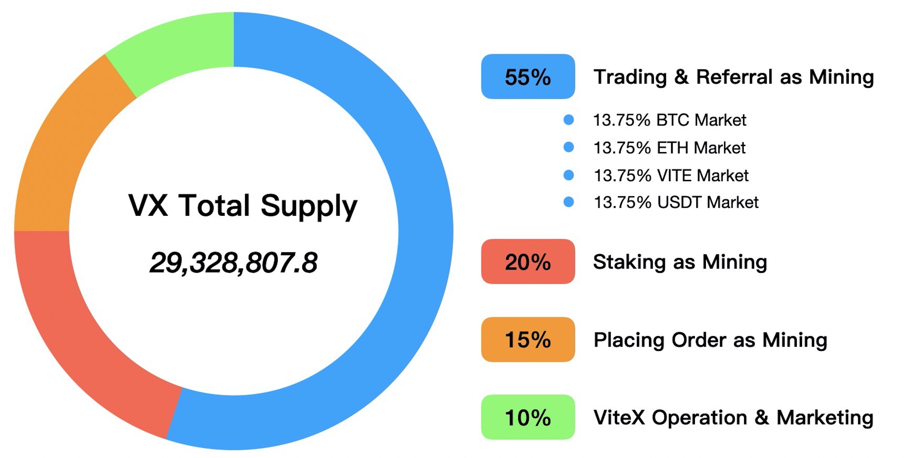
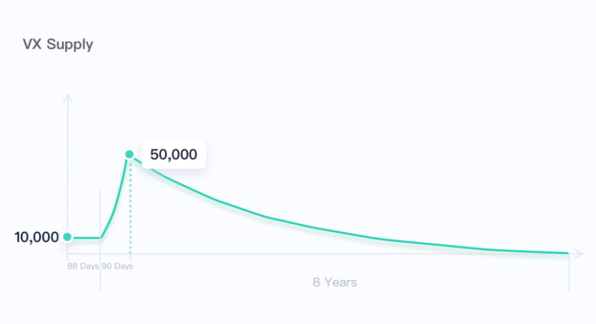

# One Pager

:::tip ViteX
Built on Vite, a zero gas and lightning fast blockchain, ViteX is a high performance cross-chain order-book DEX that matches the UX in CEXs but exceeds them in security. With a desktop app and a mobile app (iOS + Android), ViteX sees a 18.6K MAU and a daily trading volume of double-digit to 100 BTC. There are currently 60+ coins listed on ViteX and cross-chain trading is made possible by community-run gateways, it will soon be upgraded to community-managed trustless bridges, ViteBridge.

**ViteX is of the community, by the community, for the community.**
:::

* **Features**:
  * Eligible to earn daily dividends. 100% ViteX fee income is distributed to VX holders.
  * Eligible to vote in ViteX governance.
* **Total Supply (No Inflation)**: ***29,328,807.8*** 
* **Distribution**：VX, the native token to ViteX, had no presale or private sale, it can only be bought on exchanges or earned in the five following ways:
  * **Trading as Mining**: Trade in designated BTC, ETH, VITE and USDT markets and receive VX rewards.
  * **Staking as Mining**: Stake VITE to help ViteX obtain higher level operational Quota and receive VX rewards.
  * **Referring as Mining**: Generate a referral code to invite friends to join ViteX and get VX rewards.
  * **Market-Making as Mining**: Help improve order book depth by placing buy and sell orders and receive VX rewards 
  * **Listing as Mining (Operators Only)**: Become a ViteX operator and list trading pairs to collect transactions fees and receive VX rewards.

 
  
**Release schedule**：***29,328,807.8*** VX will be released over the course of **8 years** as follows:
  
 

* **Trustless Cross-Chain:**
* Staying true to a decentralized exchange, ViteX allows anyone to become an Operator in a permissionless manner, and users can create any token pair minted on the Vite chain, making it the perfect platform of liquidity for Vite ecosystem projects. 
* Vite Labs is developing ViteBridge to bring more asset security to trustless cross-chain trading, ViteBridge is deployed on BSC testnet and three more bridges are coming by the end of 2022. More details:[ViteBridge](./ViteBridge.html)

