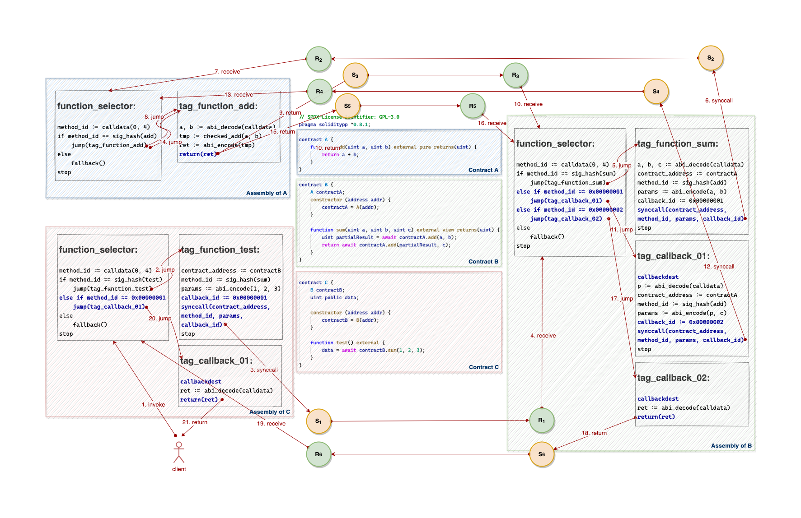

# VEP-19: Implement Synchronous Function Calls to Vite Contracts

# Background
## Composability

**Composability** is one of the core features of a decentralized ecosystem, that is, one smart contract can interact with others in unlimited combinations. So that developers can stack smart contracts on top of one another like Lego.

To achieve composability, smart contract programming languages must be designed to make it easier for contracts to talk to each other.

Solidity on EVM makes contracts inherently composable through synchronous external function calls and the ABI specification.

But for Solidity++ on Vite, things are not that simple. Because Vite is an asynchronous blockchain, calls to smart contracts on Vite are also **asynchronous**, that is, the return value cannot be obtained immediately after the call. 
Therefore, the composability can only be achieved through the callback functions in the early version of Solidity++ (before 0.8.1).

## Composability Using Callbacks
Achieving composability through callbacks is rather painful for developers.

Let's start with a simple example:
* Contract `A` has an `add()` method that returns the sum of two unsigned integers.
* Contract `B` has a `test()` method that calculates the sum of `1` and `2` by calling `A.add()`, and stores the result in the storage variable `data`.

Straightforward, the implementation in Solidity is as follows:

```javascript
// SPDX-License-Identifier: GPL-3.0
pragma solidity ^0.8.0;

contract A {
    function add(uint a, uint b) external pure returns(uint) {
        return a + b;
    }
}

contract B {
    A contractA;
    uint public data;

    constructor (address addr) {
        contractA = A(addr);
    }

    function test() external {
        data = contractA.add(1, 2);
    }
}
```

It can be implemented using callbacks in Solidity++ 0.8.0 as follows:

```javascript
// SPDX-License-Identifier: GPL-3.0
pragma soliditypp ^0.8.0;

contract A {
    function add(uint a, uint b, function(uint) external callback) external {
        if (callback.address != address(0)) {
            // send callback to return data to the caller
            callback(a + b);
        }
    }
}

contract B {
    A contractA;
    uint public data;

    constructor (address addr) {
        contractA = A(addr);
    }

    function test() external {
        contractA.add(1, 2, this.callback_onAdd);
    }

    function callback_onAdd(uint result) external {
        // receive data from the called contract
        require(msg.sender == address(contractA));
        data = result;
    }
}
```

We add an additional parameter `callback` of type `function(uint) external` to `A.add()`.

When contract `B` calls contract `A`, it needs to pass the callback function `this.callback_onAdd` as an argument of `A.add()`.

Contract `A` can obtain the address of the caller and the selector of the callback function through the `callback` parameter. It puts the result of `a + b` in the first argument and initiates a call to the `callback` function to return data to `B`.

In the callback function `callback_onAdd()` of contract `B`, it gets the result of `A.add()` from the parameter `result` and assigns it to the storage variable `data`.

It works fine and the code doesn't look too complicated, no pain at all, right? 

Once the call stack gets deeper, you won't think so anymore.

## Callback Hell

Let's expand this example a bit to see what happens.

In a more complex example:
* We add a `sum()` method to contract `B`, that calculates the sum of 3 integers by calling the `add()` method of contract `A` twice, and returns the final result to the caller by initiating a callback.
* Add another contract `C` to call contract `B` to calculate the sum of the integers `1`, `2`, and `3`.

In Solidity, implementing such an extension is straightforward.

We can initiate two calls to `A.add()` in sequence in the `B.sum()` function, and pass the partial result returned from the first call as the argument of the second call.

Here is the implementation in Solidity:

```javascript
// SPDX-License-Identifier: GPL-3.0
pragma solidity ^0.8.0;

contract A {
    function add(uint a, uint b) external pure returns(uint) {
        return a + b;
    }
}

contract B {
    A contractA;
    constructor (address addr) {
        contractA = A(addr);
    }

    function sum(uint a, uint b, uint c) external view returns(uint) {
        uint partialResult = contractA.add(a, b);
        return contractA.add(partialResult, c);
    }
}


contract C {
    B contractB;
    uint public data;
    
    constructor (address addr) {
        contractB = B(addr);
    }

    function test() external {
        data = contractB.sum(1, 2, 3);
    }
}
```

We can see that the contract `A` doesn't change anything compared to the previous example.

So can contract `A` also remain unchanged with the implementation using callbacks in Solidity++? 

Unfortunately, the answer is NO. We have to extend the called contracts to keep them composable in Solidity++ 0.8.0, the code is as follows：

```javascript
// SPDX-License-Identifier: GPL-3.0
pragma soliditypp ^0.8.0;

contract A {
    function add(uint a, uint b, function(uint, function(uint) external, uint) external callback, function(uint) external origin, uint context) external {
        if (callback.address != address(0)) {
            // send callback to return data to the caller
            callback(a + b, origin, context);
        }
    }
}

contract B {
    A contractA;

    constructor (address addr) {
        contractA = A(addr);
    }

    function sum(uint a, uint b, uint c, function(uint) external origin) external {
        // initiate the first call to A.add()
        contractA.add(a, b, this.callback_onAdd1, origin, c);
    }

    function callback_onAdd1(uint partialResult, function(uint) external origin, uint context) external {
        // receive data from the first call
        require(msg.sender == address(contractA));
        // initiate the second call to A.add() 
        contractA.add(partialResult, context, this.callback_onAdd2, origin, 0);
    }

    function callback_onAdd2(uint result, function(uint) external origin, uint) external {
        // receive data from the second call
        require(msg.sender == address(contractA));
        if (origin.address != address(0)) {
            // send callback to return final result to the caller
            // the target is contract C rather than contract A
            origin(result);
        }
    }
}

contract C {
    B contractB;
    uint public data;
    
    constructor (address addr) {
        contractB = B(addr);
    }

    function test() external {
        contractB.sum(1, 2, 3, this.callback_onSum);
    }

    function callback_onSum(uint result) external {
        require(msg.sender == address(contractB));
        data = result;
    }
}
```

Let's see what additional work is required to keep the contracts composable in Solidity++ with only callbacks:

* We need to add two callback functions to contract `B`. In the first callback function `B.callback_onAdd1()`, we receive the partial result of the first call to `A.add(a, b)`, and use this as an argument to initiate the second call to `A.add()`. In the second callback function `B.callback_onAdd2()`, we receive the final result of the second call to `A.add(a, b)`, and use this to initiate the callback to contract `C`.

* In order to initiate a callback request to the original caller `C` to return the final result, `B` must record the address of the origin. `B` can obtain the address of `C` in the function `B.sum()`, but cannot pass it to the callback function `B.callback_onAdd2()`, because the VM context cannot be shared between different functions due to the asynchronous nature of Vite. Therefore, we have to put the address and callback method id in an `origin` parameter of the `A.add()` function.

* Similarly, in order to use the third parameter `c` of the `B.sum()` function as the second argument of the second call to `A.add()`, we need to extend the parameter list of `A.add()` and `B.callback_onAdd1()` by adding a `context` parameter.

As we can see, even for such a simple scenario, the contract code has become cluttered.

It comes from the famous problem of *Callback Hell*: Using low-level callbacks makes code difficult to write and understand. It also increases the difficulty of identifying the control flow for a contract.

## Composability Using Await Operator

In order to make contracts written in Solidity++ as simple and straightforward as those written in Solidity, we need to introduce an `await` operator as in some modern programming languages such as javascript and C#. 

Await operator suspends evaluation of the enclosing async function until the asynchronous operation represented by its operand completes. When the asynchronous operation completes, it returns the result of the operation, if any. 

It helps you write synchronous-looking Solidity++ code that works asynchronously. 

When the example is implemented in Solidity++ with `await` operator, the code will be as straightforward and concise as in Solidity:

```javascript
// SPDX-License-Identifier: GPL-3.0
pragma soliditypp ^0.8.1;

contract A {
    function add(uint a, uint b) external pure returns(uint) {
        return a + b;
    }
}

contract B {
    A contractA;
    constructor (address addr) {
        contractA = A(addr);
    }

    function sum(uint a, uint b, uint c) external view returns(uint) {
        uint partialResult = await contractA.add(a, b);
        return await contractA.add(partialResult, c);
    }
}


contract C {
    B contractB;
    uint public data;
    
    constructor (address addr) {
        contractB = B(addr);
    }

    function test() external {
        data = await contractB.sum(1, 2, 3);
    }
}

```

# Implementation

## Objectives

To make this happen, the Solidity++ compiler and Vite VM have to do most mechanical works for developers under the hood.

Let's dissect the code to see what specific work needs to be done by the compiler and VM:


In summary, there are the following tasks for the compiler and VM:
* To generate callback entries for each synchronous call automatically at compile time.
* To initiate a callback request when the result is returned.
* To maintain execution context during function invocations and callbacks.

## Solidity Compiler and EVM

Before deciding how to implement it, let's take a look at the output from Solidity compiler for this example.

Pseudo assembly code for contract `A`:
```
function_selector:
method_id := calldata(0, 4)
if method_id == sig_hash(add)
    jump(tag_function_add)
else
    fallback()
stop

tag_function_add:
a, b := abi_decode(calldata)
tmp := checked_add(a, b)
ret := abi_encode(tmp)
return(ret)
```

Pseudo assembly code for contract `B`:
```
function_selector:
method_id := calldata(0, 4)
if method_id == sig_hash(test)
    jump(tag_function_test)
else
    fallback()
stop

tag_function_test:
contract_address := contractA
method_id := sig_hash(add)
params := abi_encode(1, 2)
call(contract_address, method_id, params)
ret := abi_decode(returndata)
data = ret
return
```

To make the control flow clear, let's put these in an anatomy diagram:


As shown by the red arrows in the diagram, the EVM executes external function calls through the `call` and `return` instructions.

The Solidity compiler will create a piece of code called *function selector* for each contract that includes the entries to interface functions of the contract at compile time.

When executing a message call to a contract, EVM extracts the first four bytes from *calldata* and compare against the method id of each function. If there’s a match, then jump to the definition of a corresponding function and keep executing. If there’s no match, then jump to the fallback function either defined by user or automatically created by the compiler.

When the `call` instruction gets executed, the EVM will retrieve the callee's address and load the callee’s code from the address and execute the code in an independent context.

When the `return` instruction gets executed, the EVM will place the result of the execution into the memory and exits from the callee's code, and then keep executing the remaining code of the caller.

## Solidity++ Compiler

Let's start extending the functionality on the Solidity compiler, introducing the new features mentioned above:

* To generate a callback entry, the compiler needs to traverse all `await` expressions in the contract at compile time, add a tag to each position immediately after the `await`, and add it to the function selector as a callback entry.
* To initiate a callback request when the result is returned, we need to reimplement the `return` instruction in the Vite VM to initiate a send transaction with type of `SendCallback`.
* To maintain execution context, two new instructions `synccall` and `callbackdest` need to be introduced into the Vite VM. 

The compiler places a `synccall` instruction at each synchronous call. When the VM executes the `synccall` instruction, it initiates a send transaction with type of `SendSyncCall` and persists the execution context into the local database.

Similarly, the compiler places a `callbackdest` instruction at each callback. When the VM executes the `callbackdest` instruction, it restores the execution context from the local database and then resumes execution.

This design allows the compiler to generate code that can run on an asynchronous VM for contracts written in a programming language similar to Solidity.

The example will be compiled to the following code:

Pseudo assembly code for contract `A`:
```
function_selector:
method_id := calldata(0, 4)
if method_id == sig_hash(add)
    jump(tag_function_add)
else
    fallback()
stop

tag_function_add:
a, b := abi_decode(calldata)
tmp := checked_add(a, b)
ret := abi_encode(tmp)
return(ret)
```

Pseudo assembly code for contract `B`:
<pre><code>function_selector:
method_id := calldata(0, 4)
if method_id == sig_hash(test)
    jump(tag_function_test)
<strong>else if method_id == 0x00000001
    jump(tag_callback_01)</strong>
else
    fallback()
stop
<br>tag_function_test:
contract_address := contractA
method_id := sig_hash(add)
params := abi_encode(1, 2)
<strong>callback_id := 0x00000001
synccall(contract_address, method_id, params, callback_id)</strong>
stop
<br><strong>tag_callback_01:
callbackdest
ret := abi_decode(calldata)
return(ret)</strong></code></pre>

Again, let's put these in an anatomy diagram:


The blue part of the assembly code is generated by the Solidity++ compiler specifically for the Vite VM.

The orange and green circles represent the *send* (*request*) transaction and *receive* (*response*) transaction initiated by the Vite VM, respectively.

As we can see, the compiler translates each `await` expression into a set of instructions in the same pattern: inserting a `synccall` instruction, a `stop` instruction, a jump dest tag (a `jumpdest` instruction), and a `callbackdest` instruction.

Essentially, the Vite VM treats the `synccall` instruction as an *interrupt*, which is a request for the VM to interrupt currently executing code, save its context, and initiate an asynchronous request transaction.

Correspondingly, before receiving a callback and resuming execution, the execution context needs to be restored by executing the `callbackdest` instruction.

This pattern is known as *context switch*. In a multi-task system, it refers to the process of storing the system state for a task, so that task can be paused and resumed later.

## Vite VM

Vite VM retains the semantics of most EVM instructions, but is not a clone of EVM. Therefore, new instructions such as `synccall` and `callbackdest` need to be implemented from scratch, and some EVM instructions such as `return`, `returndatasize`, `returndatacopy` need to be reimplemented to adapt to the Vite protocol.

### Transaction Types
Three new transaction types need to be introduced:

- **SendSyncCall**: A send transaction initiated by a synchronous call,
- **SendCallback**: A send transaction initiated by a callback that successfully executes and returns a result.
- **SendFailureCallback**: A send transaction initiated by a callback that fails to execute and returns an error.

### Execution Context
Each transaction with one of the three new types contains an execution context data stored in the database.

The execution context is defined as follows:

```go
ExecutionContext {
	referrer types.Hash
	callback big.Int
	stack  []big.Int
	memory []byte
}
```

For a `SendSyncCall` transaction, its execution context includes:
- `referrer` holds the send transaction hash of the upstream (origin) sync call.
- `callback` holds the 4-bytes method id of the callback function entry.
- `stack` holds a snapshot of the contract stack at the time `synccall` is executed.
- `memory` holds a snapshot of the contract memory at the time `synccall` is executed.

For a `SendCallback` or a `SendFailureCallback` transaction, its execution context only includes a `referrer` field:
- `referrer` holds the send transaction hash of the latest sync call.

If `referrer` confuses you, see the example below：

<div align="center"></div>

### SyncCall Instruction

The `synccall` instruction is implemented in pseudocode as follows:

```go
func opSynccall() {
    callback, toAddress, tokenID, amount, inOffset, inSize := vm.stack.pop(6)
	calldata := vm.mem.get(inOffset, inSize)

	if vm.Context.originSendBlock == nil {
        // upstream call
		origin := this.sendBlock
	} else {
        // load origin from VM context, it was saved by previous callbackdest
		origin := vm.Context.Origin
	}

	tx := ViteRequestTransaction {
		from: this.address,
		to: toAddress,
		type: SendSyncCall,
		value: amount,
		token: tokenID,
		data: calldata
        executionContext: ExecutionContext {
            referrer: origin.Hash,
            callback: callback,
            stack: vm.stack,
            memory: vm.memory,
	    }
    }

	vite.trigger(tx)
}
```
### Return Instruction

The `return` instruction is implemented in pseudocode as follows:

```go
func opReturn() {
    offset, size := vm.stack.pop(2)
	ret := vm.mem.get(offset, size)

	sendType := this.sendBlock.BlockType
	// need to trigger a callback transaction
	if sendType == SendSyncCall || sendType == SendCallback || sendType == SendFailureCallback {
		// get the send-block of the original call
		if vm.Context.Origin == nil {
            // the return statement is not in a callback function
            // so origin is the latest send transaction
		    origin := this.sendBlock
		} else {
            // the return statement is in a callback function
            // load origin from VM context, it was saved by previous callbackdest
			origin := vm.Context.Origin
		}

		if origin.BlockType == SendSyncCall {
			callback := origin.executionContext.callback
			// calldata of the callback: [callback_id][return_data]
			data := concat(callback, ret)

			tx := ViteRequestTransaction {
				from: this.address,
				to: origin.address,
				type: SendCallback,
				data: data,
                executionContext: ExecutionContext{
				    referrer: origin.Hash,
			    }
            }

			vite.trigger(tx)
        }
    }
```

### CallbackDest Instruction

The `callbackdest` instruction is implemented in pseudocode as follows:

```go
func opCallbackDest() {
	sendType := this.sendBlock.BlockType
	if sendType == SendCallback || sendType == SendFailureCallback {
		referrer := this.sendBlock.executionContext.referrer

		// validate sync call send block
		if referrer.address != this.address || referrer.ToAddress != this.sendBlock.address {
			return nil, error
		}

		// get upstream origin send block
		origin := referrer.executionContext.referrer

		// validate origin send block
		if origin.ToAddress != this.address {
			return nil, error
		}

		// save origin send block to VM context
		vm.Context.Origin = origin

		// restore stack
		vm.stack = referrer.executionContext.stack

		// push success flag (act as RETURN instruction in EVM)
		if sendType == SendCallback {
			// push true
			stack.push(1)
		} else { // sendType == SendFailureCallback
			// push false
			stack.push(0)
		}

		// restore memory
		vm.memory = referrer.executionContext.memory
	}
}
```

## Advanced example

<details>
  <summary>Show</summary>

### Objectives


### Solidity Compiler and EVM

Pseudo assembly code for contract `A`:
```
function_selector:
method_id := calldata(0, 4)
if method_id == sig_hash(add)
    jump(tag_function_add)
else
    fallback()
stop

tag_function_add:
a, b := abi_decode(calldata)
tmp := checked_add(a, b)
ret := abi_encode(tmp)
return(ret)
```

Pseudo assembly code for contract `B`:
```
function_selector:
method_id := calldata(0, 4)
if method_id == sig_hash(sum)
    jump(tag_function_sum)
else
    fallback()
stop

tag_function_sum:
a, b, c := abi_decode(calldata)
contract_address := contractA
method_id := sig_hash(add)
params := abi_encode(a, b)
call(contract_address, method_id, params)
partialResult := abi_decode(returndata)
params := abi_encode(partialResult, c)
call(contract_address, method_id, params)
ret := abi_decode(returndata)
return(ret)
```

Pseudo assembly code for contract `C`:
```
function_selector:
method_id := calldata(0, 4)
if method_id == sig_hash(test)
    jump(tag_function_test)
else
    fallback()
stop

tag_function_test:
contract_address := contractB
method_id := sig_hash(sum)
params := abi_encode(1, 2, 3)
call(contract_address, method_id, params)
ret := abi_decode(returndata)
data = ret
return
```


### Solidity++ Compiler

Pseudo assembly code for contract `A`:
```
function_selector:
method_id := calldata(0, 4)
if method_id == sig_hash(add)
    jump(tag_function_add)
else
    fallback()
stop

tag_function_add:
a, b := abi_decode(calldata)
tmp := checked_add(a, b)
ret := abi_encode(tmp)
return(ret)
```

Pseudo assembly code for contract `B`:
```
function_selector:
method_id := calldata(0, 4)
if method_id == sig_hash(sum)
    jump(tag_function_sum)
else if method_id == 0x00000001
    jump(tag_callback_01)
else if method_id == 0x00000002
    jump(tag_callback_02)
else
    fallback()
stop

tag_function_sum:
a, b, c := abi_decode(calldata)
contract_address := contractA
method_id := sig_hash(add)
params := abi_encode(a, b)
callback_id := 0x00000001
synccall(contract_address, method_id, params, callback_id)
stop

tag_callback_01:
callbackdest
p := abi_decode(calldata)
contract_address := contractA
method_id := sig_hash(add)
params := abi_encode(p, c)
callback_id := 0x00000002
synccall(contract_address, method_id, params, callback_id)
stop

tag_callback_02:
callbackdest
ret := abi_decode(calldata)
return(ret)
```

Pseudo assembly code for contract `C`:
```
function_selector:
method_id := calldata(0, 4)
if method_id == sig_hash(test)
    jump(tag_function_test)
else if method_id == 0x00000001
    jump(tag_callback_01)
else
    fallback()
stop

tag_function_test:
contract_address := contractB
method_id := sig_hash(sum)
params := abi_encode(1, 2, 3)
callback_id := 0x00000001
synccall(contract_address, method_id, params, callback_id)
stop

tag_callback_01:
callbackdest
ret := abi_decode(calldata)
return(ret)
```



### Vite VM


</details>
